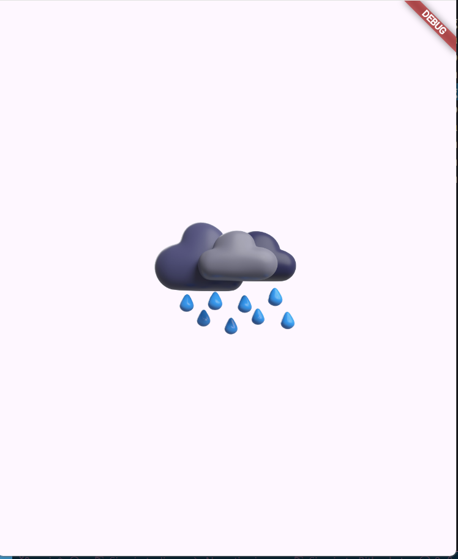
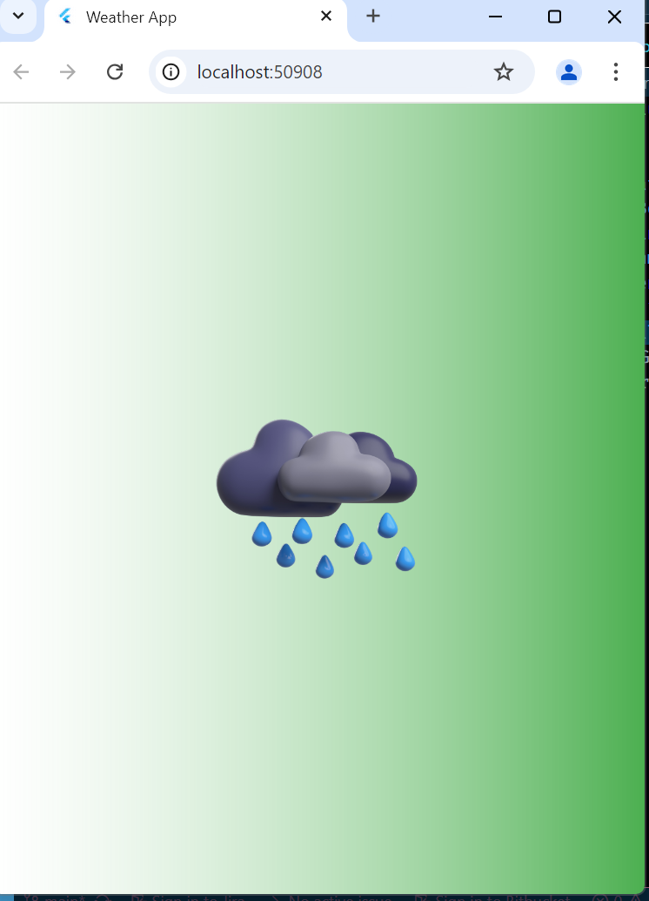

# weather_app_project

A new Flutter project With open apis.Full funcational Weather App with responsive UI/UX.

## 1st Day
- Build Repositry and Project
- Basic Steup of Project
- install dependencies and set file structure download required images

## 2nd Day
- Store the images in static variable in resource so easily by just className.VariableName
- Create a new Splash_Screen in View Folder

- Colors file in Resource for in which Create a Gradient Color in class AppColors.buildGradientBoxDecoration

